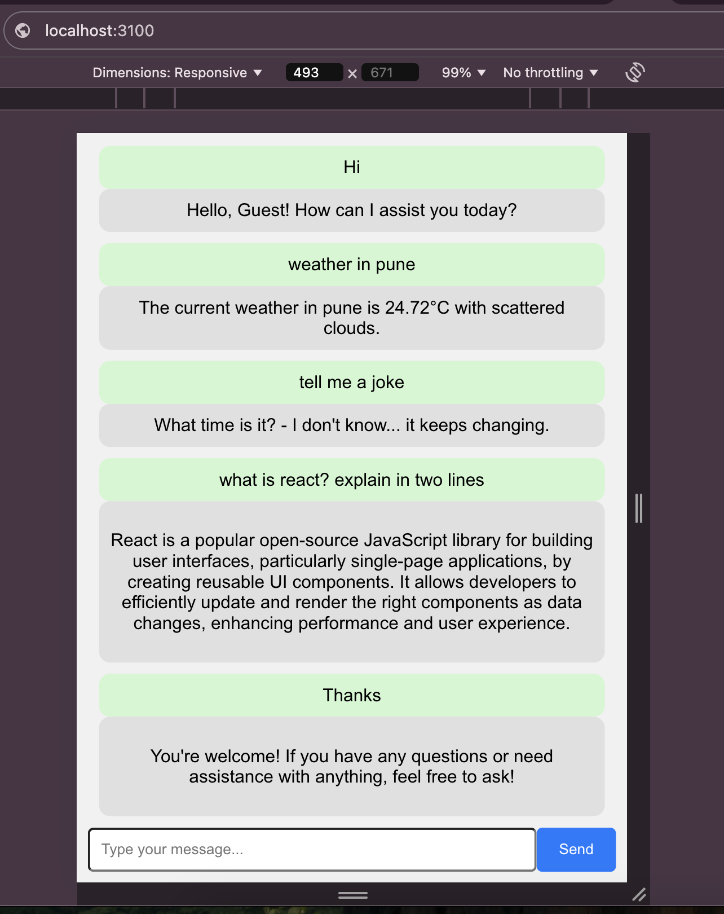

# Chatbot Application (React + Node.js + SQLite)

This is a simple chatbot application built with React for the frontend and Node.js for the backend, using SQLite as the database to store chat messages.

## Features

- **Send and Receive Messages**: Users can send messages to the bot, and the bot will respond with a predefined reply.
- **Persistent Storage**: All messages (both user and bot) are saved in an SQLite database.
- **Real-time Conversation**: The chat interface updates in real-time, displaying both user messages and bot responses.

## Technologies Used

- **Frontend**: React
- **Backend**: Node.js, Express.js
- **Database**: SQLite
- **HTTP Requests**: Axios (for communication between frontend and backend)
- **Styling**: CSS-in-JS (React inline styles)

## Prerequisites

Before running this project, make sure you have the following installed:

- [Node.js](https://nodejs.org/en/download/)
- [npm](https://www.npmjs.com/get-npm) (Node Package Manager)

## Setup and Installation

### Backend (Node.js + SQLite)

1. Clone the repository:

   ```bash
   git clone https://github.com/Tushpatil18/react-chatbot-frontend-backend.git
   cd react-chatbot-frontend-backend/chatbot-backend
   ```

2. Install backend dependencies:

   ```bash
   npm install
   ```

3. Start the backend server:

   ```bash
   node server.js
   ```

   The backend will be running on http://localhost:5001.

### Frontend (React)

1. Navigate to the directory:

   ```bash
   cd react-chatbot-frontend-backend/chatbot-frontend
   ```

2. Install frontend dependencies:

   ```bash
   npm install
   ```

3. Start the React app:

   ```bash
   npm start
   ```

   The frontend will be running on http://localhost:3100.

### Testing the Application

- Open http://localhost:3100 in your browser.
- Type a message in the input field and press "Send".
- The bot will reply with a predefined response, and the conversation will be stored in the SQLite database.
- You can refresh the page to see the entire conversation.

### Output


